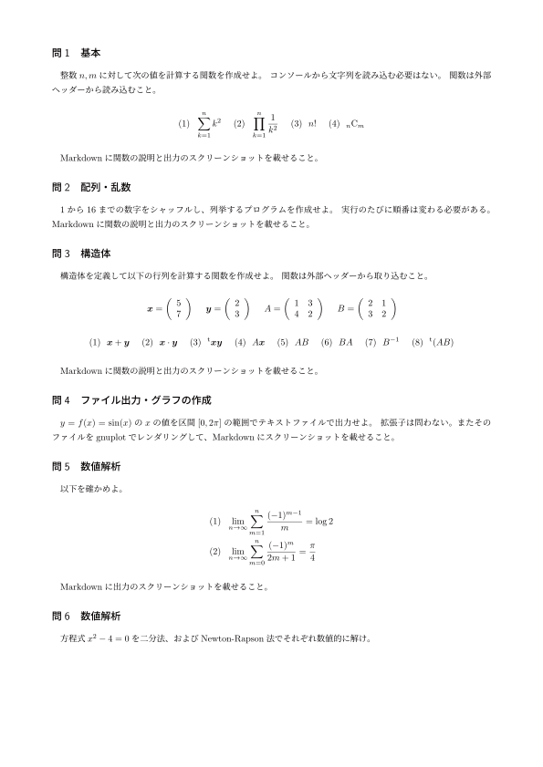

<!--

This document is written in Markdown.
You can preview on such as VisualStudio Code.
If you want to know more, search with "vscode markdown" or refer to official document https://code.visualstudio.com/Docs/languages/markdown .

-->

# 3. 課題

## 提出先
GitHub

パブリックレポジトリかプライベートレポジトリにcollaboratorsに招待してもらう。

## 提出物
- ソースコード
- makefile
- Markdown

1から6の問ごとにレポジトリを作成すること。

Markdownのファイル名は"readme.md"とすること。そこから他のMarkdownファイルの参照をすることは構わない。

`makefile`の代わりに`.sln`,`vcxproj`, `vcxproj.filters`のセットを提出してもよい。

## 提出期限
4月下旬

## 問題

----
[Back to Home](../readme.md)

<!-- Written by Croyfet in 2022-->
